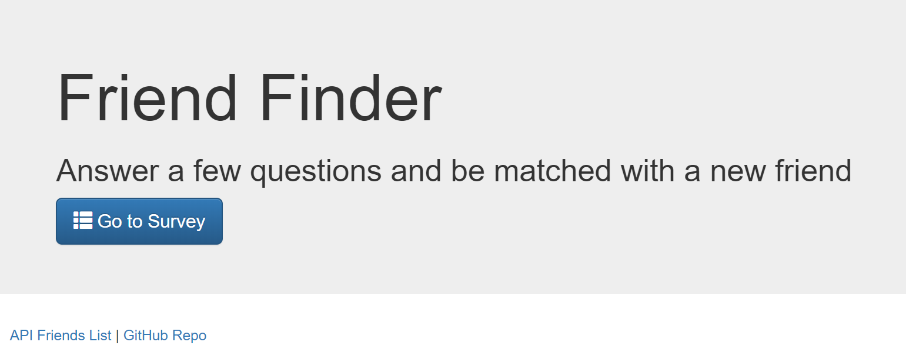
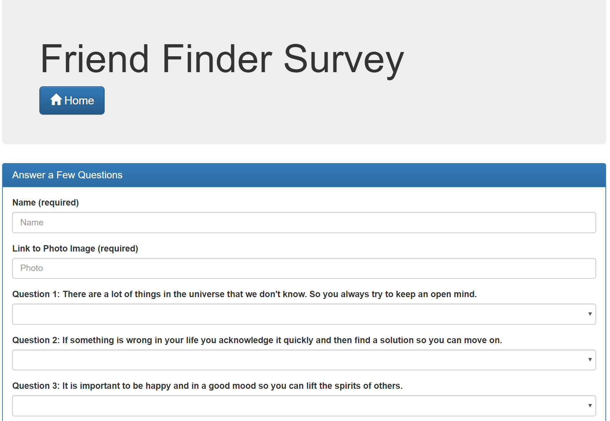

# FriendFinder

## About this Project
This is a friend-matching app to connect with like-minded individuals. The user must answer 10 questions that relate to personality and opinions. Then the app will calculate the user's score against all of the known friends in the database, and closest matching friend will be displayed. The user will see the new friend's name and photo.

Technologies used in this app include Node.js, Express and Body-Parser.

## Screenshots
Homepage (`/` route)

User Info and Sample Questions (`/survey` route)

## Install and Run
Clone the repository to your local machine. Run `npm install` to install the dependencies. Then run `npm start` to start the server on `localhost:8080`.

## Deployed Site
[https://sleepy-chamber-51992.herokuapp.com/](https://sleepy-chamber-51992.herokuapp.com/)

## My Portfolio
[https://joseph526.github.io/](https://joseph526.github.io/)